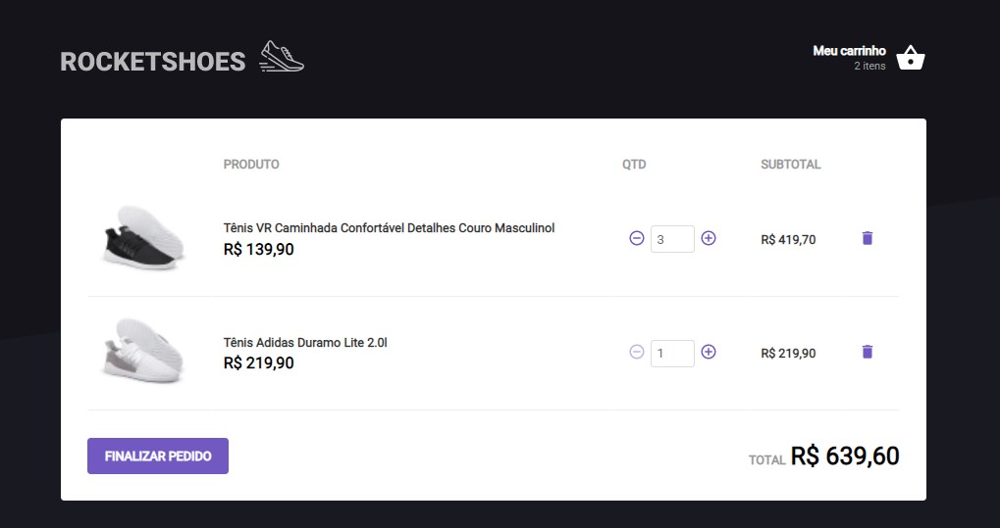
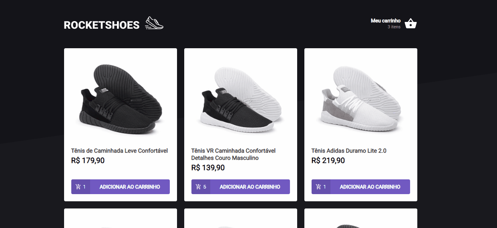

# SHOPPING CART

This is a challenge of the [Rocketseat](https://www.rocketseat.com.br/) course, when the goal is to built a cart hook for an ecommerce with the folowing functionalities:

- Add a new product into the cart;
- Remove a item from cart;
- Change the amount of a item in the cart;
- Calculate the total and subtotal of the cart;
- Inventory validation;
- Show error messages;

 

## Sumary

- [Overview]()
- [Features](#features)
  - [Local Storage API](#local_storage_API)
  - [React Toastify](#react-toastify)
  - [Cart Functionalities](#cart-functionalities)
- [Technologies](#technologies)
- [Author](#author)

## Features

### Local Storage API

All changes in cart are persisted in the browser through the local storage API, keeping cart info even if page refreshes or close.

### Cart Functionalities

Increment, decrement and remove buttons. 
Subtotal and total value.

### React Toastify

The pack [React Toastify](https://fkhadra.github.io/react-toastify/introduction/) was used to show error messages. 

### Technologies

- React JS
- Typescript
- Styled components
- Hooks
- Axios
- Local Storage API
- JSON Server

## Author

- [Github profile](https://github.com/mauricio-tejada)
- [Linkedin](https://www.linkedin.com/in/mauricio-tfernandes/)

