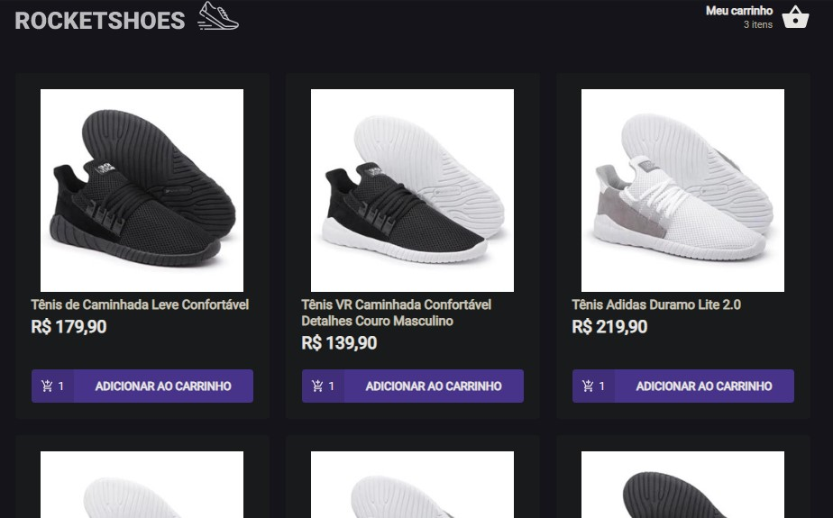

# SHOPPING CART

This is a chalenge of the Rocketseat course, when the goal is to built a cart hook for an ecommerce.

 

## Sumary

- [Overview]()
- [Features](#features)
  - [Local Storage API](#local_storage_API)
- [Technologies](#technologies)
- [Author](#author)

## Features

### Local Storage API

All changes in cart are persisted in the browser through the local storage API, keeping cart info even if page refreshes.

### React Toastfy

The pack React Toastfy was used to show error messages. 

### Technologies

- React JS
- Typescript
- Styled components
- Hooks
- Axios
- Local Storage API

## Author

- [Github profile](https://github.com/mauricio-tejada)
- [Linkedin](https://www.linkedin.com/in/mauricio-tfernandes/)

